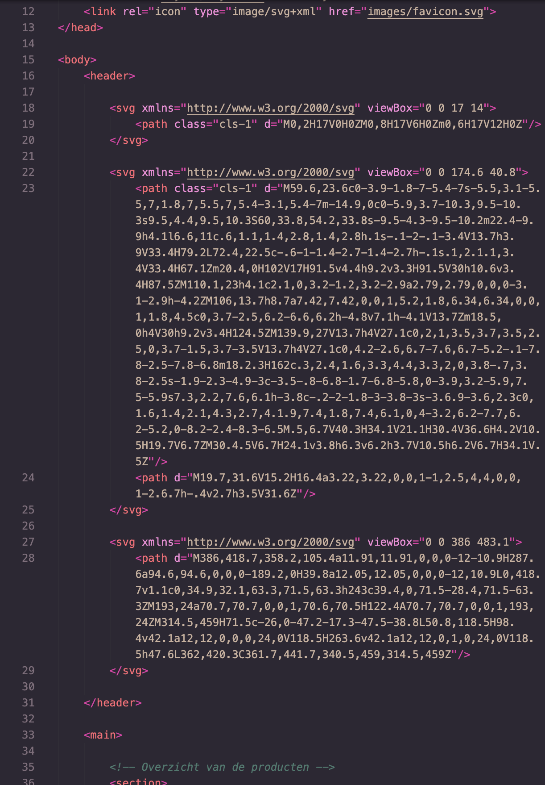
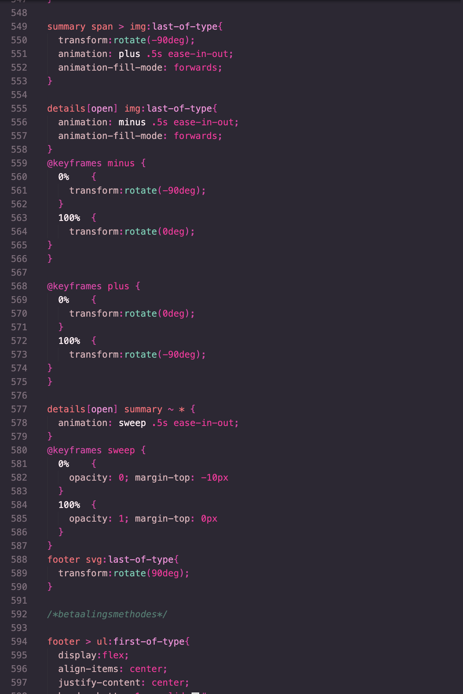
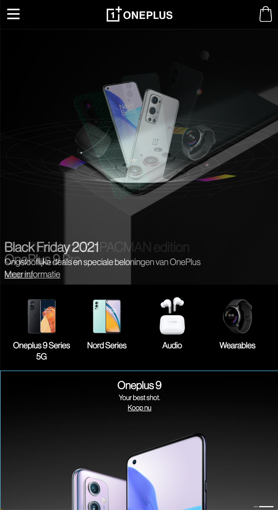
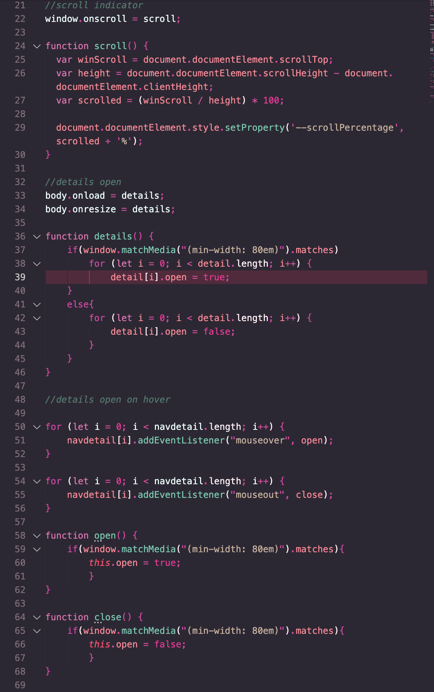

# Procesverslag
Markdown is een simpele manier om HTML te schrijven.  
Markdown cheat cheet: [Hulp bij het schrijven van Markdown](https://github.com/adam-p/markdown-here/wiki/Markdown-Cheatsheet).

Nb. De standaardstructuur en de spartaanse opmaak van de README.md zijn helemaal prima. Het gaat om de inhoud van je procesverslag. Besteedt de tijd voor pracht en praal aan je website.

Nb. Door *open* toe te voegen aan een *details* element kun je deze standaard open zetten. Fijn om dat steeds voor de relevante stuk(ken) te doen.

## Jij

uitwerken voor kick-off werkgroep

### Auteur:
Angela Luong

#### Je startniveau:
zwart

#### Je focus:
Responsive en surface plain
 

## Je website

uitwerken voor kick-off werkgroep

### Je opdracht:
OnePlus website  
https://www.oneplus.com/nl/  
https://www.oneplus.com/nl/nord-2-5g

#### Screenshot(s) van de eerste pagina (small screen): 
#### Homepagina 

#### Screenshot(s) van de tweede pagina (small screen):
#### Contactpagina

 

## Breakdownschets (week 1)

uitwerken na afloop 2e werkgroep

### de hele pagina: 

## Voortgang 1 (week 2)

uitwerken voor 1e voortgang

### Stand van zaken
De Html is nu helemaal af. Het was lastig om te bedenken hoe ik onderdelen moest groeperen maar het was wel gelukt.  

### Verslag van meeting
- Ik heb vaak H1 gebruikt in mijn HTML. Je mag dit maar 1x doen. Ik moet dit dus naar H2 veranderen
- Ik had niet alle a-tags ingevuld. Ik moet de href nog invullen. 

## Voortgang 2 (week 3)

uitwerken voor 2e voortgang

### Stand van zaken
Ik had moeite om de SVG's goed in mijn HTML te krijgen. Gelukkig had Rowin mij daar goed mee geholpen!

### Agenda voor meeting
- Hoe kan ik handig zo'n accordion maken die een lijstje laat verschijnen
- Hoe kan ik een carrousel-animatie maken 

### Verslag van meeting
- Gebruik de details en summary tag om een accordion te maken
- Robert had laten zien hoe je met keyframes een carrousel-animatie maakt. Dit had ie voor me gemaakt op <a href="https://codepen.io/robertspier/pen/eYGNqzp?editors=1100">codepen</a> :)

## Toegankelijkheidstest (week 4)

uitwerken na test in 8e voortgang

### Bevindingen

#### Geen focusstate 

Sommige onderdelen hebben geen focusstate

Dit kan opgelost worden door een focusstate in CSS toe te voegen.

#### Tekst is niet te lezen
Als je typt in het tekstveld kan je de tekst niet lezen  
 
Dit kan opgelost worden door de tekst een andere kleur te geven.

#### De footer
De focus state in de footer is heel groot 
 
Dit kan opgelost worden door de padding te verkleinen

#### Social media knoppen 
De social media knoppen hebben een extra vierkant bij de focusstate 
 
Ik weet nog niet helemaal hoe ik dat ga oplossen 

## Voortgang 3 (week 4)

uitwerken voor 3e voortgang

### Stand van zaken
Ik heb veel gewerkt aan animaties en mijn eerste pagina is zo goed als af. Ik heb deze week veel uren gemaakt!

### Agenda voor meeting
 - Hoe verbeter ik de focus state op de social media buttons?
### Verslag van meeting

- punt 1
- punt 2
- nog een punt
- ...

## Eindgesprek (week 5)

uitwerken voor eindgesprek

### Stand van zaken
Mijn site is eindelijk af! Het is me gelukt om de surface plane uit te werken en de home-pagina is ook responsive. Ik ben tijdens het maken van de site zeker tegen een aantal problemen gelopen, maar die waren goed op te lossen met hulp van de student-assistenten, docent en medestudenten!

### Screenshot(s)

 

## Bronnenlijst

continu bijhouden terwijl je werkt

Nb. Wees specifiek ('css-tricks' als bron is bijv. niet specifiek genoeg).

1. <a href="https://stackoverflow.com/questions/6195329/how-can-you-hide-the-arrow-that-is-displayed-by-default-on-the-html5-details-e">Het pijltje verstoppen bij de details tag</a>
2. <a href="https://stackoverflow.com/questions/38213329/how-to-add-css3-transition-with-html5-details-summary-tag-reveal">Animatie bij het laten verschijnen van de lijst in de details tag</a>
3. <a href="https://stackoverflow.com/questions/48093367/how-to-calculate-new-keyframe-percentages-in-a-css3-slider
">Handige manier om de tijd te calculeren in percentages voor keyframe animatie</a>
4. <a href="https://codepen.io/robertspier/pen/eYGNqzp?editors=1100">Carrousel-animatie met dank aan Robert</a>
5. <a href="https://codepen.io/MPDoctor/pen/mpJdYe?editors=1100">Het maken van tabs met gebruik van radio buttons</a>
 
6. <a href="https://www.w3schools.com/howto/tryit.asp?filename=tryhow_js_scroll_indicator">Het maken van een scroll-indicator</a>
7. <a href="https://stackoverflow.com/questions/8572952/border-length-smaller-than-div-width">De border korter maken dan de content voor de scroll-indicator</a>
8. <a href="https://davidwalsh.name/css-variables-javascript">Het aanpassen van een CSS variabele met javascript voor de scroll-indicator</a>

9. <a href="https://www.w3schools.com/howto/howto_js_media_queries.asp">Een functie uitvoeren als de window size verandert</a>
10. <a href="https://www.w3schools.com/jsref/prop_details_open.asp">Het openen van een details-tag met javascript</a>

