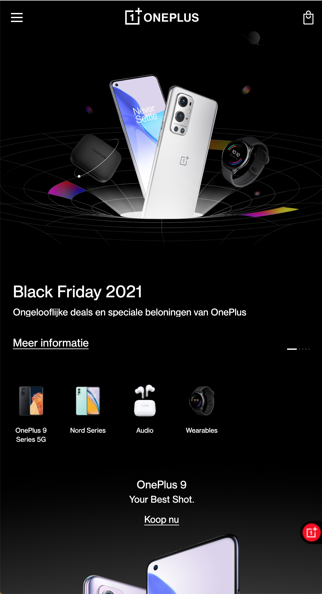

# Procesverslag
Markdown is een simpele manier om HTML te schrijven.  
Markdown cheat cheet: [Hulp bij het schrijven van Markdown](https://github.com/adam-p/markdown-here/wiki/Markdown-Cheatsheet).

Nb. De standaardstructuur en de spartaanse opmaak van de README.md zijn helemaal prima. Het gaat om de inhoud van je procesverslag. Besteedt de tijd voor pracht en praal aan je website.

Nb. Door *open* toe te voegen aan een *details* element kun je deze standaard open zetten. Fijn om dat steeds voor de relevante stuk(ken) te doen.

## Jij

uitwerken voor kick-off werkgroep

### Auteur:
Angela Luong

#### Je startniveau:
zwart

#### Je focus:
Responsive en surface plain
 

## Je website

uitwerken voor kick-off werkgroep

### Je opdracht:
OnePlus website  
https://www.oneplus.com/nl/  
https://www.oneplus.com/nl/nord-2-5g

#### Screenshot(s) van de eerste pagina (small screen): 
#### Homepagina 

#### Screenshot(s) van de tweede pagina (small screen):
#### Contactpagina

 

## Breakdownschets (week 1)

uitwerken na afloop 2e werkgroep

### de hele pagina: 

## Voortgang 1 (week 2)

uitwerken voor 1e voortgang

### Stand van zaken
De Html is nu helemaal af. Het was lastig om te bedenken hoe ik onderdelen moest groeperen maar het was wel gelukt.  

### Verslag van meeting
- Ik heb vaak H1 gebruikt in mijn HTML. Je mag dit maar 1x doen. Ik moet dit dus naar H2 veranderen
- Ik had niet alle a-tags ingevuld. Ik moet de href nog invullen. 

## Voortgang 2 (week 3)

uitwerken voor 2e voortgang

### Stand van zaken
hier dit ging goed & dit was lastig (neem ook screenshots op van delen van je website en code)

### Agenda voor meeting
samen met je groepje opstellen

| student 1      | student 2          | student 3    | student 4        |
| ---            | ---                | ---          | ---              |
| dit bespreken  | en dit             | en ik dit    | en dan ik dat    |
| en dat ook nog | dit als er tijd is | nog een punt | dit wil ik zeker |
| ...            | ...                | ...          | ...              |

### Verslag van meeting
hier na afloop snel de uitkomsten van de meeting vastleggen

- punt 1
- punt 2
- nog een punt
- ...

## Toegankelijkheidstest (week 4)

uitwerken na test in 8e voortgang

### Bevindingen

#### Geen focusstate 

Sommige onderdelen hebben geen focusstate

Dit kan opgelost worden door een focusstate in CSS toe te voegen.

#### Tekst is niet te lezen
Als je typt in het tekstveld kan je de tekst niet lezen  
 
Dit kan opgelost worden door de tekst een andere kleur te geven.

#### De footer
De focus state in de footer is heel groot 
 
Dit kan opgelost worden door de padding te verkleinen

#### Social media knoppen 
De social media knoppen hebben een extra vierkant bij de focusstate 
 
Ik weet nog niet helemaal hoe ik dat ga oplossen 

## Voortgang 3 (week 4)

uitwerken voor 3e voortgang

### Stand van zaken
hier dit ging goed & dit was lastig (neem ook screenshots op van delen van je website en code)

### Agenda voor meeting
samen met je groepje opstellen

| student 1      | student 2          | student 3    | student 4        |
| ---            | ---                | ---          | ---              |
| dit bespreken  | en dit             | en ik dit    | en dan ik dat    |
| en dat ook nog | dit als er tijd is | nog een punt | dit wil ik zeker |
| ...            | ...                | ...          | ...              |

### Verslag van meeting
hier na afloop snel de uitkomsten van de meeting vastleggen

- punt 1
- punt 2
- nog een punt
- ...

## Eindgesprek (week 5)

uitwerken voor eindgesprek

### Stand van zaken
hier dit ging goed & dit was lastig (neem ook screenshots op van delen van je website en code)

### Screenshot(s)

hier screenshot(s) van je eindresultaat

## Bronnenlijst

continu bijhouden terwijl je werkt

Nb. Wees specifiek ('css-tricks' als bron is bijv. niet specifiek genoeg).

1. bron 1
2. bron 2
3. ...

